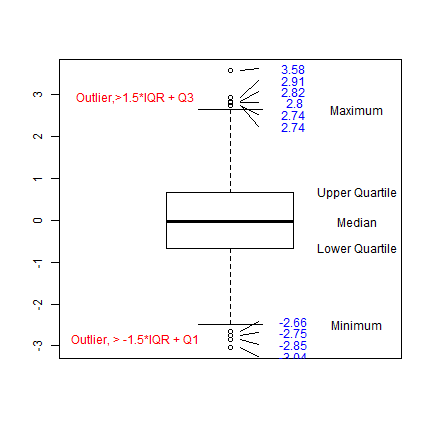

<style>
.title-slide {
background-image: url(assets/img/tier3-back.png);
}
</style>

## Background

### 1. Data and Issue
* 
* Outlier pairs in the historical control and treatment data for 14 Mallard Duck repros?
* Other data characteristics: e.g. correlation in the egg pathway. 

### 2. Outlier Detection Methods

* Charts(Boxplots, Percentiles)
* Statistical Tests/Model based Methods

### 3. Outlier Treatment

* Learn the story behind the "outlier", influential or not? spurious, or just an extreme point?
* Alternative methods robust to outliers or models incoporating the effect caused by outliers.
* Eliminate the outliers with clear statement of reasons.


--- &twocol w1:40% w2:60%

## Boxplot

*** =left

### Advantages:

* Non-parametric; No assumptions of the underlying statistical distribution.

* A quick way of examining one or more sets of data graphically: indicating the spread and skewness in the data and identifying outliers.

*** =right

### How to read a boxplot? 


```
## Loading required package: TeachingDemos
```

 


--- &twocol w1:40% w2:60%


### Boxplot vs Percentiles


*** =left

Figure 1: Boxplot vs. Percentiles

 


*** =right

Reproducible R Script:


```r
x <- rnorm(1000)
a <- boxplot.with.outlier.label(x, 
    label_name = formatC(x, digits = 3), 
    range = c(1.5, 3))
abline(h = quantile(x, c(0.95, 
    0.05)), col = 2)
text(1.5, quantile(x, c(0.95, 
    0.05)) + 0.2, c("95%", "5%"), 
    col = 2)
abline(h = quantile(x, c(0.99, 
    0.01)), col = 3)
text(0.5, quantile(x, c(0.99, 
    0.01)) + 0.2, c("99%", "1%"), 
    col = 3)
```


--- .class #id 

## Demonstrate Calculation for Penflufen

### 1. Read in data


```r
setwd("C:/Users/z.gao/Documents/Projects/outlier2014/Outlier/")
require(XLConnect)
wb1 <- loadWorkbook("data/Penflufen Mallard Repro Data (3Feb14).xlsx")
setMissingValue(wb1, value = ".")
sheetsnames <- getSheets(wb1)
Mallard = readWorksheet(wb1, sheet = "Mallard SAS Data", startRow = 9, endRow = 72, 
    useCachedValues = TRUE, header = FALSE)
colnames = readWorksheet(wb1, sheet = "Mallard SAS Data", startRow = 7, endRow = 8, 
    useCachedValues = FALSE, header = FALSE)
colnames <- apply(colnames, 2, function(x) paste(x[1], x[2]))
colnames[2] <- "Treatment"
names(Mallard) <- colnames
### 
```


--- .class #id 

## Demonstrate Calculation for Penflufen

### 1. Clean the data

* Check egg pathway data:A "0" should followed by NA entries in the pathway. 

For example, if no eggs set, the entries for viable embryos, live 3wk embryos, hatchlings, 14 d old survivors should be NA. 
* Check egg quality data: 
* if no eggs laid or all eggs were set, egg shell strength and thickness should be NA.
* if no hatchlings, hatchling weight should be NA.
* if no 14 d old survivors, 14 d old survivors wt should be NA. 


```r
Mallard <- check_eggpathway(Mallard)
Mallard <- check_eggquality(Mallard)
# cache('Mallard')
```


--- 

## Penflufen

### 2. Study the data first by exploratory data analysis


--- &twocol w1:70% w2:30%

## Penflufen

### 2. Study the data first by exploratory data analysis

*** =left


 


*** =right


```r
require(reshape2)
lMallard <- melt(Mallard, id.vars = 1:3)
label <- getlabel(lMallard)
require(ggplot2)
p <- ggplot(data = lMallard, 
    aes(x = Treatment, y = value, 
        fill = Treatment)) + 
    stat_boxplot(geom = "errorbar") + 
    geom_boxplot() + facet_wrap(~variable, 
    scale = "free") + ggtitle("Boxplot of Penflufen Mallard Data")
print(p)
```


--- &twocol w1:70% w2:30%

## Penflufen

### 3. Identify outliers and do further calculations.

*** =left


<video   controls="controls" ><source src="assets/fig/unnamed-chunk-16.ogg" />video of chunk unnamed-chunk-16</video>


*** =right


```r

endpoints <- names(Mallard)[4:19]
for (i in 4:19) {
    boxplot.with.outlier.label(Mallard[, 
        i] ~ Mallard$Treatment, 
        label_name = Mallard[!is.na(Mallard[, 
            i]), "Cage No."], 
        push_text_right = 1.5, 
        main = endpoints[i - 
            3], range = c(1.5, 
            2.5))
}
```


--- .class #id 

## Penflufen

### 3. Identify outliers and do further calculations.


--- &twocol w1:70% w2:30%

## Penflufen

*** =left

 


*** =right

 


--- .class #id

## Summary Tables for Penflufen


|  Treatment  |     endpoint     |  no.outlier  |   outlier   |
|:-----------:|:----------------:|:------------:|:-----------:|
|      A      |    Eggs Laid     |      2       |    3,14     |
|      B      |    Eggs Laid     |      1       |     115     |
|      C      |    Eggs Laid     |      0       |             |
|      D      |    Eggs Laid     |      0       |             |
|      A      |  Viable Embryos  |      2       |    3,14     |
|      B      |  Viable Embryos  |      1       |     115     |
|      C      |  Viable Embryos  |      0       |             |
|      D      |  Viable Embryos  |      0       |             |
|      A      | Live 3wk Embryos |      0       |             |
|      B      | Live 3wk Embryos |      1       |     116     |
|      C      | Live 3wk Embryos |      2       |   211,212   |
|      D      | Live 3wk Embryos |      3       | 308,310,315 |


--- .class #id 

## Control and NOEC data for 14 BCS studies

### 1. Graphical overview of the data by Study

<video   controls="controls" ><source src="assets/fig/unnamed-chunk-23.ogg" />video of chunk unnamed-chunk-23</video>


--- .class #id 

## Control and NOEC data for 14....

### 2. Outliers in combined historic data.

<video   controls="controls" ><source src="assets/fig/unnamed-chunk-25.ogg" />video of chunk unnamed-chunk-25</video>


--- .class #id 

## Control and NOEC data for 14 BCS studies

### 3. Summary table of the outlier information

Suppose we have three studies $S_1, S_2, S_3$ with $n_1=15,n_2=16,n_3=15$ pairs respectively. Using boxplot stats for each study, we identified $o_1=0$ outliers in $S_1$, $o_2=1$ outliers in $S_2$, $o_3=3$ outliers in $S_3$. Using boxplot stats for all three studies pooled together, we identified $op_1=0$ outliers in $S_1$, $op_2=1$ outliers in $S_2$, $op_3=0$ outliers in $S_3$. 

|       Types of Summary Statistics      |       Pooling Studies  |  Each Study Seperately  |
|:--------------------------------------:|:----------------------:|:-----------------------:|
| N1= # of studies with outlier pairs    |    1                   |      2                  |  
| N2= # of outlier pairs                 |    $op_1+op_2+op_3$    |     $o_1+o_2+o_3$       |  
| F1= % of studies with outlier pairs    |    $1/3*100$           |    $2/3*100 $           |  
| F2= % of all outlier pairs in all pairs|    $\frac{op_1+op_2+op_3}{n_1+n_2+n_3}$    |     $\frac{o_1+o_2+o_3}{n_1+n_2+n_3}$       |  
| F3= average % of outliers in each study|    $(\frac{op_1}{n_1}+\frac{op_2}{n_2}+\frac{op_3}{n_3})/3*100$    |     $(\frac{o_1}{n_1}+\frac{o_2}{n_2}+\frac{o_3}{n_3})/3*100$       |  


--- .class #id 

## Control and NOEC data for 14 BCS Studies

### 3. Outlier pairs information for historical control data.


|           &nbsp;           |  &nbsp;  |  &nbsp;  |  Sep  |  &nbsp;  |  &nbsp;  |  &nbsp;  |  &nbsp;  |  Pool  |  &nbsp;  |  &nbsp;  |
|:--------------------------:|:--------:|:--------:|:-----:|:--------:|:--------:|:--------:|:--------:|:------:|:--------:|:--------:|
|                            |    F1    |    F2    |  F3   |    N1    |    N2    |    F1    |    F2    |   F3   |    N1    |    N2    |
|       **Eggs Laid**        |    50    |  5.687   | 5.714 |    7     |    12    |  35.71   |  3.318   | 3.304  |    5     |    7     |
|      **Eggs Cracked**      |  92.86   |  12.92   | 12.87 |    13    |    27    |   100    |  21.53   | 21.58  |    14    |    45    |
|        **Eggs Set**        |  21.43   |  2.885   | 2.891 |    3     |    6     |  14.29   |  0.9615  | 0.9864 |    2     |    2     |
|     **Viable Embryos**     |  42.86   |  5.797   | 6.006 |    6     |    12    |  42.86   |  6.763   | 6.954  |    6     |    14    |
|    **Live 3wk Embryos**    |  57.14   |  5.556   | 5.782 |    8     |    11    |  35.71   |  2.525   |  2.82  |    5     |    5     |
|  **Number of Hatchlings**  |  21.43   |  2.538   | 2.744 |    3     |    5     |    0     |    0     |   0    |    0     |    0     |
|   **14 d old survivors**   |    50    |  5.687   | 5.714 |    7     |    12    |  35.71   |  3.318   | 3.304  |    5     |    7     |
|  **Egg shell thickness**   |  21.43   |  2.913   | 2.976 |    3     |    6     |  21.43   |  1.456   | 1.548  |    3     |    3     |
|   **Egg shell strength**   |  21.43   |  2.899   | 2.857 |    3     |    6     |    0     |    0     |   0    |    0     |    0     |


*** pnotes
Summary tables of the outliers

--- .class #id

## Control and NOEC data for 14 BCS Studies

### 3. Outliers information for historical NOEC data.


|  &nbsp;  |  &nbsp;  |  Sep  |  &nbsp;  |  &nbsp;  |  &nbsp;  |  &nbsp;  |  Pool  |  &nbsp;  |  &nbsp;  |
|:--------:|:--------:|:-----:|:--------:|:--------:|:--------:|:--------:|:------:|:--------:|:--------:|
|    F1    |    F2    |  F3   |    N1    |    N2    |    F1    |    F2    |   F3   |    N1    |    N2    |
|  42.86   |  3.333   | 3.333 |    6     |    7     |  57.14   |  4.286   | 4.256  |    8     |    9     |
|  64.29   |  7.729   | 7.975 |    9     |    16    |   100    |  24.64   | 24.52  |    14    |    51    |
|  28.57   |  2.439   | 2.415 |    4     |    5     |  28.57   |  2.439   | 2.351  |    4     |    5     |
|  57.14   |  8.293   | 8.349 |    8     |    17    |  71.43   |  9.756   | 9.614  |    10    |    20    |
|    50    |  7.179   | 7.452 |    7     |    14    |    50    |  5.128   | 4.976  |    7     |    10    |
|  57.14   |  6.736   | 6.845 |    8     |    13    |  35.71   |  2.591   | 2.641  |    5     |    5     |
|  42.86   |  3.333   | 3.333 |    6     |    7     |  57.14   |  4.286   | 4.256  |    8     |    9     |
|  28.57   |  3.483   | 3.372 |    4     |    7     |  7.143   |  0.4975  | 0.4762 |    1     |    1     |
|  28.57   |   1.97   | 1.875 |    4     |    4     |  14.29   |  0.9852  | 0.9864 |    2     |    2     |


--- &twocol w1:40% w2:60%

## Control and NOEC data for 14 BCS Studies

### 4. Correlation between eggpath endpoints: 

*** =left

 


*** =right

 


## Control and NOEC data for 14 BCS Studies

### 4. Correlation between hatchling biomass and other factors:

*** =left

 


*** =right

 


--- &twocol w1:40% w2:60%

## Control and NOEC data for 14 BCS Studies

### 4. Correlation in all treatment groups: 

*** =left

 


*** =right

 


*** pnotes

transition with high success rates vs transitions with lower success rates


--- .class #id 

## Appendix A: Methods of Statistical Outlier Analysis

* Charts: extreme values.
* Local Outlier Factor(LOF): the points in a much sparser region than their neighbors.
* Clustering: subjects not assigned to any clusters.
* Statistical Tests/Model Based Methods
* The Lund test for outliers was based on fitting the linear model
* Grubbs' test is based on the assumption of normality.
* Dixon's test allows us to examine if one (and only one) observation from a small set of replicate observations (typically 3 to 25) can be "legitimately" rejected or not.
* Bonferroni Outlier Test reports the Bonferroni p-values for Studentized residuals in linear and generalized linear models, based on a t-test for linear models and normal-distribution test for generalized linear models.

* Others

--- .class #id 

## Lund test

The Lund test for outliers was based on fitting the linear model (See Lund, R. E. 1975). Lund suggested to test the studentized residuals against an appropriate t-value (the residuals are assumed as approximately distributed according to a Student's t-distribution). He suggests to test with a Bonferroni adjusted alpha, i.e. with quantile of the t-distribution qt((1-alpha/(2*n)),df) where n is the number of residuals and df the error degrees of freedom. This is similar to Bonferroni-adjusted outlier test.


--- .class #id


## Grubb's test

Grubbs' test is based on the assumption of normality. That is, one should first verify that the data can be reasonably approximated by a normal distribution before applying the Grubbs' test. The general formula for Grubbs' test statistic is defined as:

$$G=\frac{\max(x_i-\bar x)}{s}$$

The Grubbs test statistic is the largest absolute deviation from the sample mean in units of the sample standard deviation. 


--- .class #id


## Dixon's test

Dixon's test allows us to examine if one (and only one) observation from a small set of replicate observations (typically 3 to 25) can be "legitimately" rejected or not. 

The test is very simple and it is applied as follows:

1. The N values comprising the set of observations under examination are arranged in ascending order: $x_1 < x_2 < . . . < x_N$

2. The statistic experimental Q-value (Qexp) is calculated. This is a ratio defined as the difference of the suspect value from its nearest one divided by the range of the values (Q: rejection quotient). Thus, for testing $x_1$ or $x_N$ (as possible outliers) we use the following Qexp values:

$$
Q_N=\frac{X_N-X_{N-1}}{X_N-X_1}
$$
$$ Q_1=\frac{X_2-X_1}{X_N-X_1}
$$

(3) The obtained Qexp value is compared to a critical Q-value (Qcrit) found in tables. This critical value should correspond to the confidence level (CL) we have decided to run the test (usually: CL=95%).

Note: Q-test is a significance test. For more information on terms and concepts related to significance tests (e.g. null hypothesis, confidence levels, probabilities of type I and type II errors), see the applet: Student's t-test:  Comparison of two means.

(4) If Qexp > Qcrit, then the suspect value can be characterized as an outlier and it can be rejected, if not, the suspect value must be retained and used in all subsequent calculations.

The  null hypothesis associated to Q-test is as follows: "There is no a significant difference between the suspect value and the rest of them, any differences must be exclusively attributed to random errors".

--- .class #id


## Bonferroni Outlier Test

Bonferroni Outlier Test reports the Bonferroni p-values for Studentized residuals in linear and generalized linear models, based on a t-test for linear models and normal-distribution test for generalized linear models.

Since we are selecting the furthest outlier, it is not legitimate to use a simple t-test. We would expect that 5% of the studentized
residuals would be beyond t.025± 2 by chance alone. To remedy this we can make a Bonferroni adjustment to the p-value. The Bonferroni p-value for the largest outlier is $p=2np_0$, where $p_0$ is the unadjusted p-value from a t-test with $n-k-2$ degrees of freedom.

Note that  we could also fit a random intercept model instead of a fixed effect model.

--- .class #id

## Other Outlier Detection Methods

The methods listed in the following may be overshoots for our problem.

* Distribution-based:
Using a subset of the data, the parameters for a model distribution are estimated using regression of the sorted data on their QQ-plot positions. A value in the data is an outlier when it is unlikely to be drawn from the estimated distribution. There are two methods to determine the "unlikelyness". The first, called "Method I", determines the value above which less than $\rho$ observations are expected, given the total number of observations in the data. Here $\rho$ is a parameter which should have a value of 1 or less. The second notion of unlikelyness uses the fit residuals. Extremely large or small values are outliers when their residuals are above or below a confidence limit, to be determined by the researcher.
* Quantile Regression Methods
* Multivariate methods based on ordered robust mahalanobis distances.
* Train an unsupervised Random Forest on the data and use the object proximity measure to detect outliers  [link](http://www.stat.berkeley.edu/~breiman/RandomForests/cc_home.htm#outliers)
* Multivariate robust estimators[link](http://cran.r-project.org/web/packages/rrcov/vignettes/rrcov.pdf)
* and more!

--- .class #id 

## Appendix B: Outlier Treatment

If there are outliers, what do we do?

1. Learn as much as you can about the "story" behind the data and understand why there is an outlier.

2. Find a method that is not sensitive to outliers. For example, alternatives to Pearson's correlation coefficient include Spearman's rank correlation coefficient and Kendall's coefficient of concordance , although neither of them works any better here. In cases where the cause of the outliers is known, it may be possible to incorporate this effect into the model structure, for example by using a hierarchical Bayes model or a mixture model

3. Adjust the outliers when appropriate (data trimming).

4. If all else fails, eliminate the outlier(s).


--- .class #id


```r
setwd("mydeck")
require(slidify)
slidify("mydeck/index.Rmd")
```


